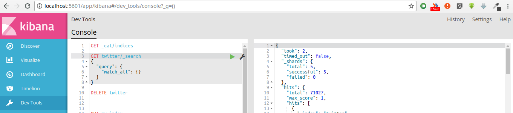
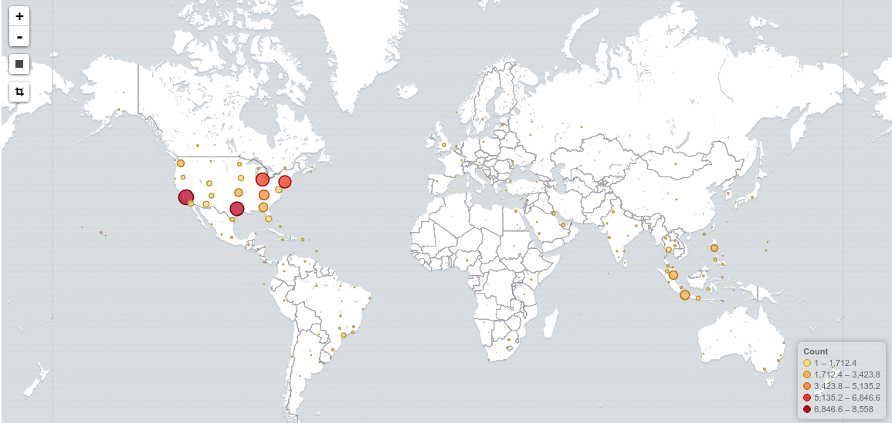

# Savitr
Early Warning System. A geotagged tweet map. Protector of the realm

# Setup

Please refer to the original [setup doc](https://github.com/JaredHawkins/TweetGeoViz) since it does not differ yet.


# Runnning the system

Have a `mongod` instance running in a terminal. Now, in 2 separate terminals:

```
npm run server:start
npm run client:dev
```

## Own setup with mongo, elasticsearch and kibana

* [robo3t](https://askubuntu.com/questions/739297/how-to-install-robomongo-on-ubuntu/781793). If needed, here's a [fix](https://github.com/Studio3T/robomongo/issues/1384).

* [Setup elasticsearch](https://discuss.elastic.co/t/cant-start-elasticsearch-with-ubuntu-16-04/48730/9)

* Starting ES - `sudo service elasticsearch start` - check with `status` instead of start.

* Find mongo entry with field containing string:
```
    db.getCollection('ControlTweets').find({"t" : {$regex : ".*damage.*"}})
```

* [Kibana installation](https://www.elastic.co/guide/en/kibana/current/deb.html) and [Getting started](https://www.elastic.co/guide/en/kibana/current/introduction.html)


* [ES setup with kibana](https://www.elastic.co/start) {Don't install any plugin yet}

* [Migrate from json to ES](https://www.elastic.co/guide/en/kibana/3.0/import-some-data.html). The actual migration is explained as below.

Sample data

```
{
  "_id": "516799596153307136",
  "lang": "en",
  "plt": -5.799,
  "uid": "67763278",
  "tlt": -5.822,
  "cc": "BR",
  "f": "tw201492918305",
  "p": "a4ddc3856053f7e1",
  "flrs": 1014,
  "acr": {
    "$date": 1250900341000
  },
  "t": "@barrosmirella questão de ideias e conceitos. Você se definiu homofóbica nessa frase. Ngm precisa aceitar e/ou apoiar a homossexualidade*",
  "cr": {
    "$date": 1412049600000
  },
  "pln": -35.221,
  "tln": -35.229,
  "flng": 273
}

```

* Define a mapping for this. In terminal, once kibana and ES  installed. Run both with - `sudo service elasticsearch start` and `sudo service kibana start`
```
curl -XPUT http://localhost:9200/twitter -d '
{
 "mappings" : {
  "_default_" : {
   "properties" : {
    "tweet_id" : {"type": "string"},
    "lang" : {"type": "string" },
    "uid" : { "type" : "string" },
    "tlt" : { "type" : "float" },
    "cc" : {"type": "string" },
    "f" : {"type": "string" },
    "p" : {"type": "string" },
    "flrs" : {"type": "integer" },
    "acr": {"type": "object"},
    "t" : {"type": "string" },
    "cr": {"type": "object"},
    "pln": {"type": "float"},
    "tln": {"type": "float"},
    "flng": {"type": "integer"},
    "t_location": {"type": "geo_point"}
   }
  }
 }
}
';
```

* Now, we'll be converting available json file into indexable form:

 * split files into 50 parts: `split twitter.json -n 50`
 * run `python enlister.py xaa` - this generates output.json which is present in the repo already.
 * Upload

  ```
`curl -XPUT localhost:9200/_bulk --data-binary @output.json`
```

You can check if it worked by going on http://localhost:9200/_cat/indices?v


Once you get Kibana up and running, navigate to `localhost:5601` > Dev tools and write down the following query:
```
`GET twitter/_search`
{
  "query": {
    "match_all": {}
  }
}
```

you should get some successful hits like the image below.



Create a visulization using t_location as geohash. The resulting product looks likes this:



We've managed to get our system running. [Install postman](https://blog.bluematador.com/posts/postman-how-to-install-on-ubuntu-1604/) for later use.


## mongo query dump

* `db.getCollection('tweets_collection').find({$text: {$search: "disaster"}})`