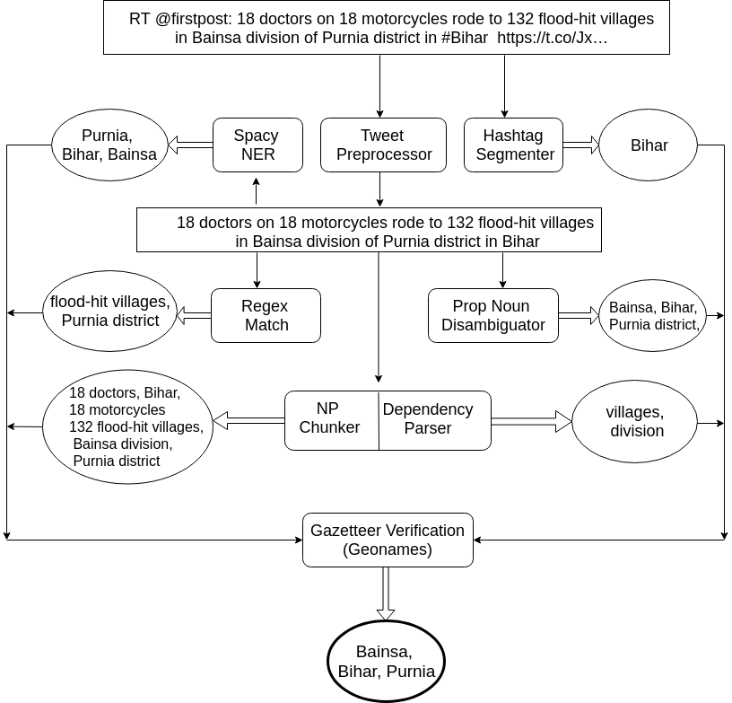
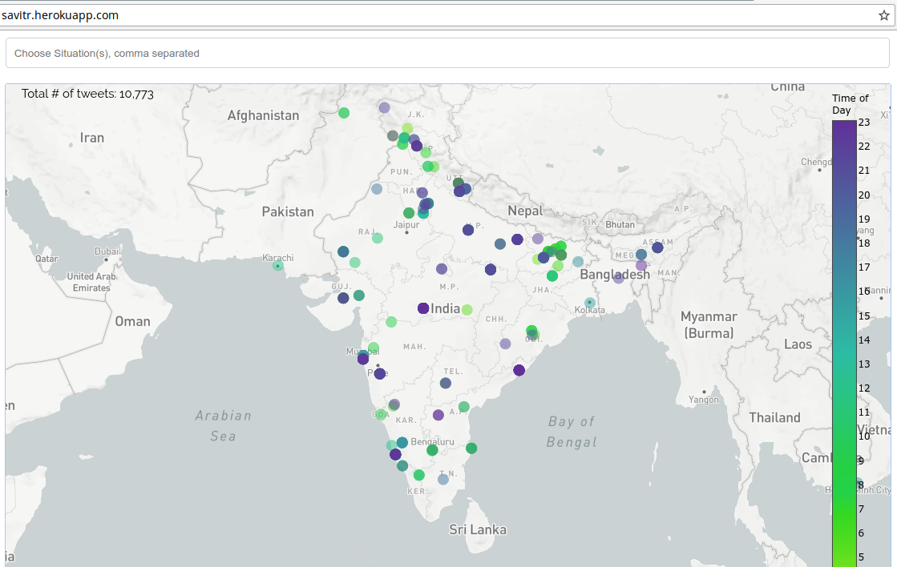

# Savitr
Early Warning System. A geotagged tweet map. Protector of the realm.

Social Computing CS60017 term project, turned to paper [SAVITR: A System for Real-Time Location Extraction from Microblogs during Emergencies](https://arxiv.org/pdf/1801.07757.pdf) accepted at [Social Media for Emergency Response and Preparedness (SMERP)](https://www.cse.iitk.ac.in/users/kripa/smerp2018/) workshop at [Webconf (WWW'18)](https://www2018.thewebconf.org/) conference.

A local copy of the paper is available at [paper/SAVITR.pdf](paper/SAVITR.pdf). The poster presented at [International Conference for Networked Digital Earth (ICDNE)](http://cse.iitkgp.ac.in/conf/NSDE/sds/ICNDE2018/) is available at [paper/SAVITR-poster.pdf](paper/SAVITR-poster.pdf).

## Contents

* [Description](#description)
* [Proposed methodology](#proposed_methodology)
* [Evaluation](#evaluation)
* [Savitr System](#savitr_system)
* [Future Work](#future_work)

## Description

[↥ back to top](#contents)

SAVITR is an automated, real-time system which utilises the information posted on Twitter to observe and analyse emergency situations. Our system employs natural language processing techniques to extract locations in an unsupervised fashion and projects the results on a map-based platform. SAVITR is designed specifically for efficient performance, achieving a decent F1-score of  **0.81** and is approximately two orders of magnitude faster than currently available systems. A prototype of the system is deployed live at [http://savitr.herokuapp.com](http://savitr.herokuapp.com).

We collected tweets over 1 month which contained the words 'Flood' and 'Dengue'. From the entire set of 239,276 distinct tweets, only 3,493 were geo-tagged, out of which 869 were from India (which corresponds to a minute 0.36% of the entire dataset). The number of tweets which were successfully tagged from the entire dataset, using our proposed technique and Geonames was 68,793, which corresponds to approximately 26.15%.

## Proposed Methodology

[↥ back to top](#contents)

For a tweet _RT firstpost: 18 doctors on 18 motorcycles rode to 132 flood-hit villages in Bainsa division of Purnia district in #Bihar_



* Statistically segmented hashtag (#Nepalquake) into distinct words, but also retained the original one (Bengaluru yields Bengal and Uru).

* Preprocessed the tweet text to remove URLs, mentions, ellipses, emojis and stray characters. Abstained from case folding and stemming.

* Disambiguated Proper Nouns using a POS Tagger and considered those which were preceeded by viable location-based prepositions (in, from) or appended by common suffixes of locations.

* Compiled a list of common location-based suffixes and direction-based prefixes. Applied regex similarity to identify the words surrounding these suffix and prefix elements as viable locations.

* Performed Dependency Parsing on the processed tweet text to obtain nouns which are at short dependency distance from the emergency word. We also account for noun phrase and the words identified as locations by a publicly available NER like coreNLP.

* Gazetteer Verification of these potential phrases and words to retain only those that correspond to real-world locations. The azetteer choice depends on the granularity and precision of our location and also on performance speed.

The gazetteer itself was accumulated by scraping Geonames and Open street map. We consider two variants of our proposed algorithm.
* GeoLoc - Our algorithm using Geonames.
* OSMLoc - Our algorithm using OSM

## Evaluation

[↥ back to top](#contents)

We have considered precision, recall and F1-score,
along with the average performance time over a
dataset of 100 tweets as the evaluation metrics.


Method | Precision | Recall | F-score | Time (in s) |
:--- | :---: | :---: | :---: | ---:
UNILoc | 	0.3848 | 	0.7852 | 	0.5165 | 	0.0553 |
BILoc | 	0.4025 | 	0.8590 | 	0.5482 | 	0.0624 |
StanfordNER |  0.8103 | 	0.6322 | 	0.6988 | 	175.0124 |
TwitterNLP | 	0.6356 | 	0.5474 | 	0.5882 | 	28.0001 |
GoogleCloud | 	0.6321 | 	0.5339 | 	0.5789 | 	NA |
SpaCyNER  |  **0.9883** |  0.5555 | 0.7113  | 1.0891 |
 --- | --- | --- | --- | --- |
GeoLoc  | 	0.7987 | 	0.8300 | **0.8141** | 	1.1901 |
OSMLoc  |  0.3383 |  **0.8888** | 0.4901  | 711.5817 |
GeoLocNoNER |  0.7987 | 	0.7987 | 0.7987 | 	1.1687 |

* UniLoc- Take the unigrams in the processed tweet text and infer if they are viable locations.
* BiLoc- Similar to UniLoc, except we consider both unigrams and bigrams in the tweet text.

We observe that GeoLoc performs the best in terms of F1 score as compared to all other methods. It also scores high on precision, ranking only third to StanfordNER and SpaCyNER. The high precision of SpaCyNer is counterbalanced by its poor recall due to which it was hardly able to detect remote places.

The proposed method using GeoNames gazetteer is much faster than the other methods which achieve
comparable performance (e.g., StanfordNER)

## Savitr system

[↥ back to top](#contents)

The Savitr system is deployed live at
http://savitr.herokupapp.com. It supports multiple
search queries, and displays both tagged tweets and
untagged tweets along with the daily statistics.



Snapshot of the SAVITR system

* A search bar at the top of the page. Whenever a term is entered into the search bar, the map refreshes and shows tweets pertaining to that query term. It also supports multiple search queries like "Dengue, Malaria".

* The tweets on the map are color coded according to the time of the day. Tweets posted in the night are darker.

* A date-picker – if one wishes to visualize tweets posted during a particular time duration, this provides fine grained date selection, both at the month and date level.

* A Histogram – this shows the number of relevant (tagged) tweets posted per day.

* Untagged tweets – Finally, at the bottom of the page we display the tweets for which location could not be inferred (and hence they could not be shown on the map).

The work for the webapp is available at [AvijitGhosh82/Savitr-Python](https://github.com/AvijitGhosh82/Savitr-Python), head on there to view the app code.

## Future Work

[↥ back to top](#contents)

We intend to modify the algorithm to include tweets posted in languages other than English as well as extend the reach of the system to tweets posted outside India. The massive information influx would necessitate implementing automated summarization algorithms to capture and display summaries on the system.

### File heirarchy

* [draft_report](draft_report/) - Semester project report.
* [paper](paper/) - Source files (TeX) for paper submission.
* [data](data/) - Analyse patterns in data using mongodb.
* [fill_mongo_jsons.py](fill_mongo_jsons.py) - Convert scraped data 
* [INPUT_FILES](INPUT_FILES/) - Raw unprocessed data for 30 days for flood and dengue. 

### People involved

* [Ritam Dutt](http://cse.iitkgp.ac.in/~ritam.dutt/)
* [Kaustubh Hiware](http://kaustubhhiware.github.io)
* [Avijit Ghosh](https://avijitghosh82.github.io/)
* [Rameshwar Bhaskaran](http://cse.iitkgp.ac.in/~rbhaskaran/)
* [Nishant Nikhil](https://nishantnikhil.github.io/)
* [Prof. Saptarshi Ghosh](https://sites.google.com/site/saptarshighosh/)


ACM Reference Format:
```
Ritam Dutt, Kaustubh Hiware, Avijit Ghosh, and Rameshwar Bhaskaran.
2018. SAVITR: A System for Real-time Location Extraction from Microblogs
during Emergencies. In WWW’18 Companion: The 2018 Web Conference
Companion, April 23–27, 2018, Lyon, France. ACM, New York, NY, USA,
7 pages. https://doi.org/10.1145/3184558.3191623
```
### License

This paper is published under the Creative Commons Attribution 4.0 International (CC BY 4.0) license. Authors reserve their rights to disseminate the work on their
personal and corporate Web sites with the appropriate attribution.

WWW’18 Companion, April 23–27, 2018, Lyon, France © 2018 IW3C2 (International World Wide Web Conference Committee), published under Creative Commons CC BY 4.0 License. ACM ISBN 978-1-4503-5640-4/18/04. https://doi.org/10.1145/3184558.3191623